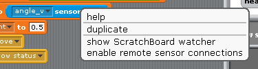
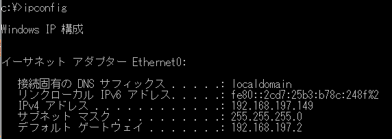
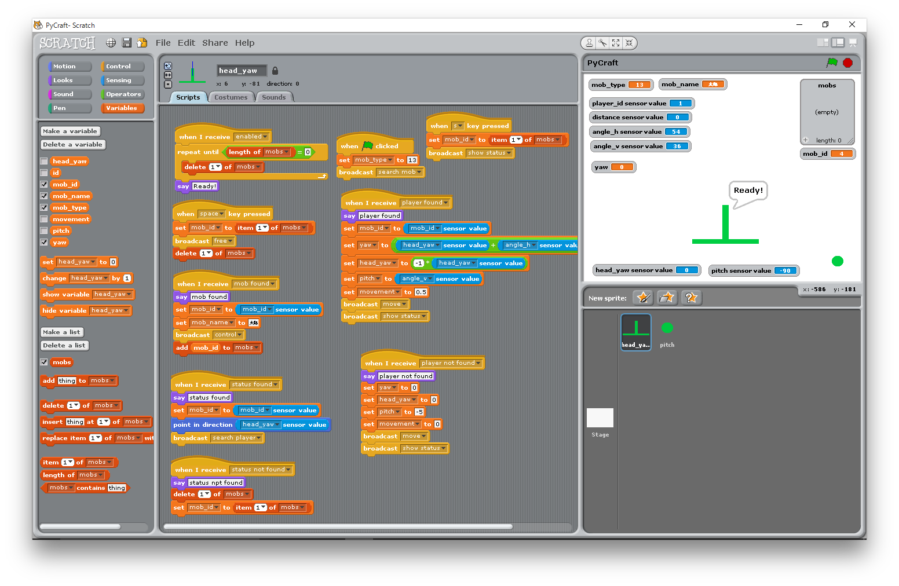

# PyCraft
Multiplay server of Minecraft Pocket Edition

Support version:
- Python 3.5
- Minecraft Pocket Edition 0.13.1
- Scratch 1.4

(Written in Japanese)

## 使用方法

1. Python 3.5 をインストールする
1. PyCraft を展開する
1. `$ cd PyCraft`
1. `$ export PYTHONPATH=src`
1. `$ python3.5 src/pycraft/main.py` を実行する
    - `bash` では `$ source bashrc` とした後に `$ pycraft` とすれば起動します。

(誰か起動スクリプト書いてくれないかな...)

## 設定

`src/pycraft/service/config.py` で設定を変えられます。

(いずれ設定ファイルで設定するようにする予定)

## できること

- マルチプレイヤー ログイン/ログアウト (同時 2 人までしか試してないけど...)
- ワールド生成 (最低限...)
    - 樹木 : 1 種類
    - 鉱石 : ない
    - 草花 : ない
    - 諸々 : ない...
- ブロック破壊 (出現するアイテムの種類は違うけど...)
    - 砂、砂利 : 落下します。
- アイテム拾得 (できて当たり前？)
- アイテム作成 (そこそこ作れるはず)
    - 動作確認済 : 作業台、ストーンカッター、チェスト、かまど、ドア、看板、松明
    - ツルハシ、シャベル、斧、クワ、剣 : 壊れます。
- 生物スポーン (明るさに関係なく出現します...)
    - 当たり判定に失敗しており、壁に埋まります。
    - 真っ直ぐに寄ってきます。
    - コウモリ : 羽を閉じたまま飛びます。
    - **Scratch 1.4 remote sensor connections を使用して操作できます。**
- 攻撃 (できちゃう)
    - 倒すとアイテムを落とします。

## できないこと

他、たくさん。

何もできないじゃん。
という方には [Pocket Mine MP](https://www.pocketmine.net/?lang=ja) をお勧めします。

## Scratch 1.4 連携

Scratch 1.4 には remote sensor connections という機能があります。
この機能を使い Scratch から Minecraft の生物を操作できるようにしています。
remote sensor connections は Scratch 2.0 にはありません。

### 使用方法

1. [Scratch 1.4](https://scratch.mit.edu/scratch_1.4/) を用意する
1. Scratch で remote sensor connections を有効にする
    - sensor value を選んで右クリック
    - 
1. Scratch が起動している PC の IP アドレスを調べる
    - 
1. PyCraft の設定を変更する
    - `src/pycraft/service/config.py` の `scratch_network` を変更する
        - `192.168.197.149` なので `scratch_network = '192.168.197.0/24'`
        - `192.168.20.15` ならば `scratch_network = '192.168.20.0/24'`
1. PyCraft を起動する
    - 自動的に `scratch_network` で指定したネットワークをスキャンします
    - 接続に成功すると PyCraft を起動した画面に `new scratch agent` と表示されます
    - Scratch には `enabled` がおくられ(broadcast され)ます。
1. Scratch でプログラムをつくる
    - 
    - メッセージがおくられて(broadcast されて)くるときには、
      『センサーのあたい(sensor value)』に値が設定されます
    - メッセージをおくる(broadcast する)ときには、
      『へんすう(variable)』に値を設定してからおくります
    - PyCraft からおくられる(broadcast される)メッセージと
      設定される『センサーのあたい(sensor value)』
        - `enabled` : PyCraft と接続が成功したとき
        - `mob found` : `search mob` をおくり、
           生物が見つかったとき
            - `mob_id` : 生物の番号
        - `mob not found` : `search mob` をおくり、
           生物が見つからなかったとき
        - `status found` : `show status` をおくり、
           生物の状態がわかった(生きていた)とき
            - `head_yaw` : 頭の水平向き(-180度〜180度、体の向きとの差)
            - `pitch` : 頭の垂直向き(-90度〜90度)
        - `status not found` : `show status` をおくり、
           生物の状態がわからなかった(死亡していた)とき
        - `player found` : `search player` をおくり、
           生物がプレイヤーを発見したとき
            - `player_id` : プレイヤーの番号
            - `distance` : 生物とプレイヤーの距離
            - `angle_h` : 頭の水平向きとプレイヤーの位置の差(-180度〜180度)
            - `angle_v` : 頭の垂直向きとプレイヤーの位置の差(-90度〜90度)
        - `player not found` : `search player` をおくり、
           生物がプレイヤーを発見できなかったとき
    - Scratch からおくる(broadcast する)メッセージと
      設定する『へんすう(variable)』
        - `search mob` : 生物を探す
            - `mob_type` : 探す生物の種類(整数)
        - `control` : 生物を支配する
            - `mob_id` : 支配する生物の番号(`mob_found` で得た `mob_id`)
            - `mob_name` : 生物につける名前(日本語可)
        - `free` : 生物を解放する
            - `mob_id` : 解放する生物の番号(`control` で指定した `mob_id`)
        - `show status` : 生物の状態を見る
            - `mob_id` : 対象の生物の番号(`control` で指定した `mob_id`)
        - `search player` : 生物に周囲のプレイヤーを探させる
            - `mob_id` : 対象の生物の番号(`control` で指定した `mob_id`)
        - `move` : 生物を移動させる
            - `mob_id` : 対象の生物の番号(`control` で指定した `mob_id`)
            - `yaw` : 体の向き(-360度〜360度、現在の向きとの差)
            - `head_yaw` : 頭の水平向き(-180度〜180度、体の向きとの差)
            - `pitch` : 頭の垂直向き(-180度〜180度、現在の向きとの差)
            - `movement` : 前後の移動量(-1.0〜1.0)

| `mob_type` | 種類 |
|:----------:|:----:|
| 10 | ニワトリ |
| 11 | 牛 |
| 12 | 豚 |
| 13 | 羊 |
| 14 | オオカミ |
| 15 | 村人 |
| 16 | ムーシュルーム |
| 17 | イカ |
| 19 | コウモリ |
| 32 | ゾンビ |
| 33 | クリーパー |
| 34 | スケルトン |
| 35 | クモ |
| 36 | ゾンビピッグマン |
| 37 | スライム |
| 38 | エンダーマン |
| 39 | シルバーフィッシュ |
| 40 | 洞窟グモ |
| 41 | ガスト |
| 42 | マグマキューブ |

## このプロジェクトについて

PyCraft は Python を学習するための題材として開発をはじめたプロジェクトです。
scratchpy という Scratch 1.4 と連携する Python ライブラリを発見し、
ほんの思いつきから Scratch 1.4 連携機能を実装しました。

PyCraft は Pocket Mine MP のソースコードを元に書かれています。
はじめは Pocket Mine MP のソースコードの一部を Python 2.7 に移植しました。
途中で Python 3.5 に移植しています。
Pocket Mine MP から移植した時点では Minecraft のバージョンは 0.11 でした。
プロトコルを解析しながら 0.13 で動くようにしましたが、多くの機能は未実装です。

時間に余裕があるときに開発を継続する予定です。
